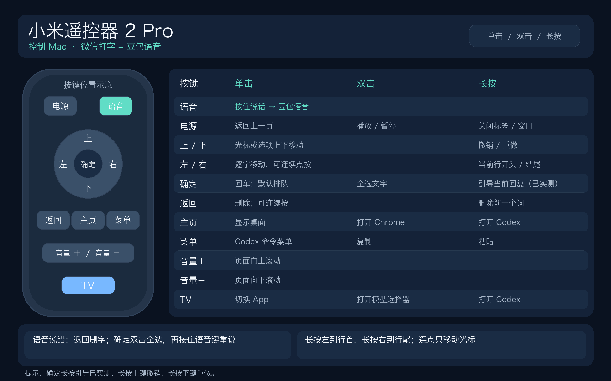

# 小米遥控器 2 Pro 控制 Mac 与 Codex

一套可复用的 [SayAll（无线麦）](https://github.com/HD838A/remote-mic-app) 按键方案：用小米蓝牙遥控器 2 Pro 控制 Mac、Chrome 和 Codex；按住语音键用豆包识别，平时键盘保留微信输入法。

本仓库提供 **按键预设、安装说明和独立的输入法恢复辅助程序**。SayAll、豆包输入法、微信输入法和 Codex 均需从各自官方渠道安装；本仓库不包含它们的二进制文件，也不是 SayAll 的 fork。上游 SayAll 项目及许可见[其仓库](https://github.com/HD838A/remote-mic-app)。



[下载原尺寸按键速查图](assets/remote-keymap-zh.png)

## 先看效果

| 遥控器 | 单击 | 双击 | 长按 |
| --- | --- | --- | --- |
| 语音 | 按住说话，松开结束；豆包识别 | — | — |
| 方向左／右 | 逐字移动光标或选择项 | 保留连续单击，不另设动作 | 当前行开头／结尾 |
| 方向上／下 | 光标或选项上下移动 | — | 撤销／重做 |
| 确定 | 回车；Codex 运行时按其默认设置排队 | 全选 | `⌘Return`，引导当前回复 * |
| 返回 | 删除前一个字符，可连续按 | 保留连续删除 | 删除前一个词 |
| 主页 | 显示桌面 | 打开 Chrome | 打开 Codex |
| 菜单 | `⌘K`，由当前 App 解释 | 复制 | 粘贴 |
| 电源 | `⌘[`，返回上一级 | 播放／暂停 | 关闭当前窗口或标签 |
| TV | 切换 App | `⌃⇧M`，Codex 模型选择器 * | 打开 Codex |
| 音量＋／－ | 页面向上／向下滚动 | 不设置 | 不设置 |

完整设计和适用范围见[按键说明](docs/keymap.md)。`*` 表示依赖 Codex 版本与焦点状态；确定键长按的“引导”已在这台 Mac 上的**回复进行中、输入框聚焦**场景通过实体按键测试。当前 Codex 桌面版默认“回车发送”时，会在回复中把 `⌘Return` 解释为与默认排队相反的“引导”；在空闲时，同一个键只会正常发送一条新消息。

## 首次设置

环境：macOS 13+、小米蓝牙遥控器 2 Pro（RC003）、SayAll 1.9.21（本预设核对版本）、Python 3；若使用语音，还需要豆包输入法、微信输入法和 SayAll 支持的虚拟麦克风。具体安装要求以[SayAll 上游说明](https://github.com/HD838A/remote-mic-app#%E4%BD%BF%E7%94%A8%E8%A6%81%E6%B1%82)为准。

1. 从 [SayAll 官方 GitHub Releases](https://github.com/HD838A/remote-mic-app/releases)安装适合本机架构的版本。在 macOS 蓝牙设置中配对遥控器，打开 SayAll，完成蓝牙、输入监控和辅助功能授权。确认连接页显示遥控器已连接。
2. 安装 Chrome 和 Codex。打开 SayAll 的“按键”页，启用自定义按键功能；配对完成后应已有一条 RC003 设备档案。
3. **完全退出 SayAll**，在本仓库目录执行：

   ```bash
   python3 preset/apply.py          # 只检查，不写入
   python3 preset/apply.py --apply  # 备份原偏好并应用映射
   ```

4. 重新打开 SayAll，在“按键”页确认“确定长按＝`Command-Return`”、方向键单击＝箭头、TV 长按＝打开 Codex。先用短按左右、返回删除和电源双击做实体测试。
5. 若要“微信打字＋豆包语音”，按[语音与输入法设置](docs/voice-input.md)配置 SayAll、豆包、微信，并安装可选的 `voice-restore` 辅助程序。

脚本只支持已配对的 RC003 档案；有多只 RC003 时先运行检查，再用 `--profile-index N` 指定目标。原偏好备份保存在 `~/Library/Application Support/XiaomiRemoteCodexPreset/backups/`，**不要上传该备份**。预设数据在 [`preset/keymap.json`](preset/keymap.json)；脚本保留其他设备档案。仅当 SayAll 只有一只已配对遥控器时，脚本才同步更新供其使用的全局按键映射。

## 给 Agent 的一段话

> 请阅读此仓库的 README、`AGENTS.md`、`docs/keymap.md` 和 `docs/voice-input.md`。先确认 SayAll 来自 HD838A/remote-mic-app 官方发布、遥控器型号为 RC003 且已配对。运行 `python3 preset/apply.py` 做只读检查；经我授权配置后，退出 SayAll，运行 `python3 preset/apply.py --apply`，重启并核对按键页。需要微信打字＋豆包语音时再安装 `voice-restore`。不要上传我的 SayAll 偏好、设备标识、日志、语音或 Codex 会话。用实体遥控器验证关键动作，尤其是“确定长按引导”。

## 恢复与排障

- **长句变成蓝色下划线后消失**：检查 `voice-restore` 是否切换过早。当前默认松开语音键后等 3 秒再恢复微信；可用 `--restore-delay-ms` 调整。先验证文字稳定上屏，再验证键盘回到微信。
- **按键没反应**：先看 SayAll 是否仍显示已连接，重新打开应用并测试方向键。不要把 TV 长按设为“聚焦输入框”：在 SayAll 自己处于前台时，该动作曾使 1.9.21 卡住。
- **确定长按只发送或没反应**：确认 Codex 前台且底部输入框有焦点，任务正在回复，Codex 的 `followUpQueueMode` 是 `queue`，SayAll 长按动作是 `Command-Return`。空闲时只会发送新消息。若修改了 Codex 的回车行为，参照[按键说明](docs/keymap.md)调整组合键。
- **恢复原配置**：退出 SayAll，用备份文件执行 `defaults import com.hd838a.RemoteMic '<备份文件路径>'`，再启动 SayAll。备份含本机私有设备信息，仅留本机。

## 验证与边界

这套映射基于 SayAll 1.9.21 在一台 RC003 遥控器上的实体测试。已实测方向移动、删除、TV 双击模型选择、Chrome 播放／暂停、豆包语音通路，以及 Codex 运行中长按确定引导。SayAll 的偏好存储格式不是公开稳定接口，升级后应先只读检查，再由 Agent 对照新版 UI 验证，避免盲目导入。

本仓库的辅助程序代码采用 [MIT 许可](LICENSE)。SayAll、Codex 与输入法各自遵循其原项目条款。
